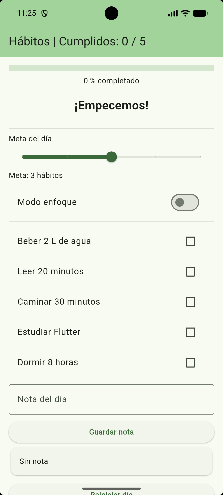
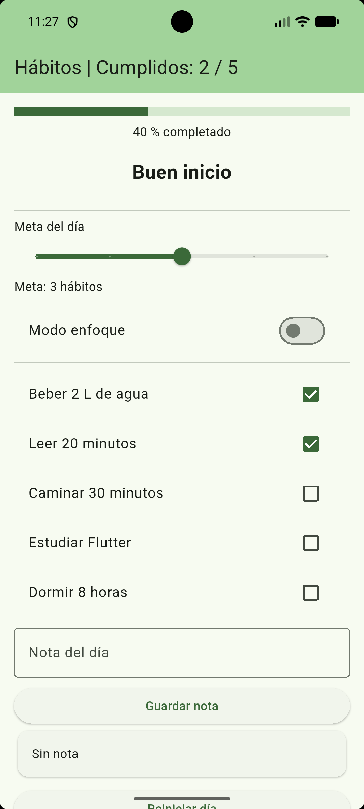
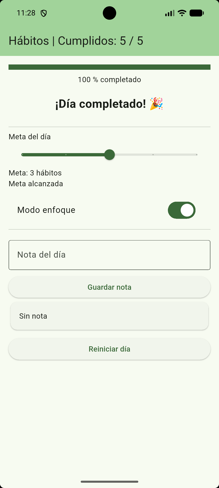
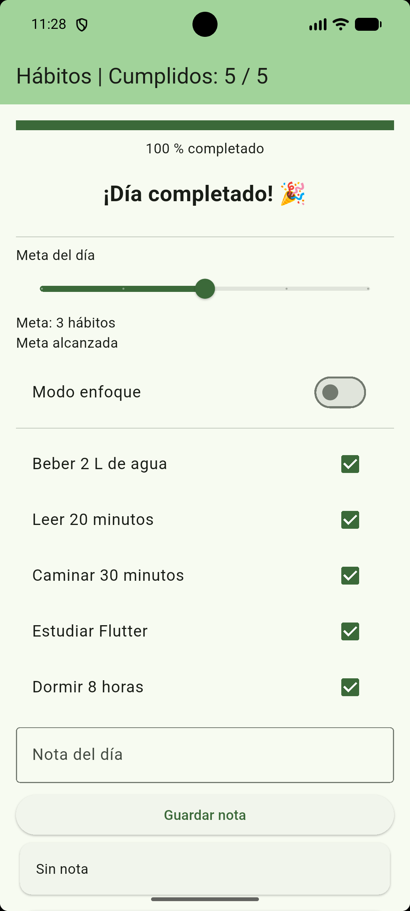

# Panel de hábitos del día

Aplicación desarrollada en Flutter para llevar el control de cinco hábitos durante el día.

La aplicación permite marcar hábitos como cumplidos, visualizar el progreso, establecer una meta diaria, activar un modo enfoque, guardar una nota y reiniciar la información del día.

## Funcionalidades

- Lista de cinco hábitos con `CheckboxListTile`.
- Contador de hábitos cumplidos.
- Barra de progreso según los hábitos completados.
- Mensaje motivacional que cambia según el porcentaje.
- Meta diaria configurable mediante un `Slider`.
- Mensaje de `Meta alcanzada` cuando se cumple la meta.
- Modo enfoque para ocultar los hábitos ya completados.
- Campo para guardar una nota del día.
- Botón para reiniciar todos los datos.

## Variables de estado

La pantalla principal utiliza un `StatefulWidget`.

Las principales variables utilizadas son:

| Variable | Descripción |
| --- | --- |
| `_cumplidos` | Guarda si cada hábito está cumplido o no. |
| `_meta` | Guarda la cantidad de hábitos que se desean cumplir. |
| `_enfoque` | Indica si el modo enfoque está activado. |
| `_nota` | Guarda la nota del día. |
| `_notaCtrl` | Controla el texto ingresado en el campo de la nota. |

También se utilizan getters para calcular el total de hábitos cumplidos, el progreso, el mensaje motivacional y si la meta fue alcanzada.

Los cambios de estado se realizan utilizando `setState()`.

## Capturas









## Reflexión

Este proyecto me ayudó a comprender mejor cómo manejar estados en Flutter y cómo estructurar una interfaz con interacción real del usuario. La parte más importante fue aprender a combinar `StatefulWidget`, `setState()` y widgets como `Slider`, `SwitchListTile` y `CheckboxListTile` para crear una experiencia funcional y útil en la vida diaria.

También me permitió ver la importancia de la organización del código y del diseño de una aplicación que no solo se ve bien, sino que además aporta valor práctico. En general, este laboratorio me mostró cómo Flutter facilita la construcción de apps con lógica clara, buena presentación visual y un flujo de trabajo adaptable para proyectos más complejos.

## Ejecución

Para ejecutar el proyecto:

```bash
flutter pub get
flutter run